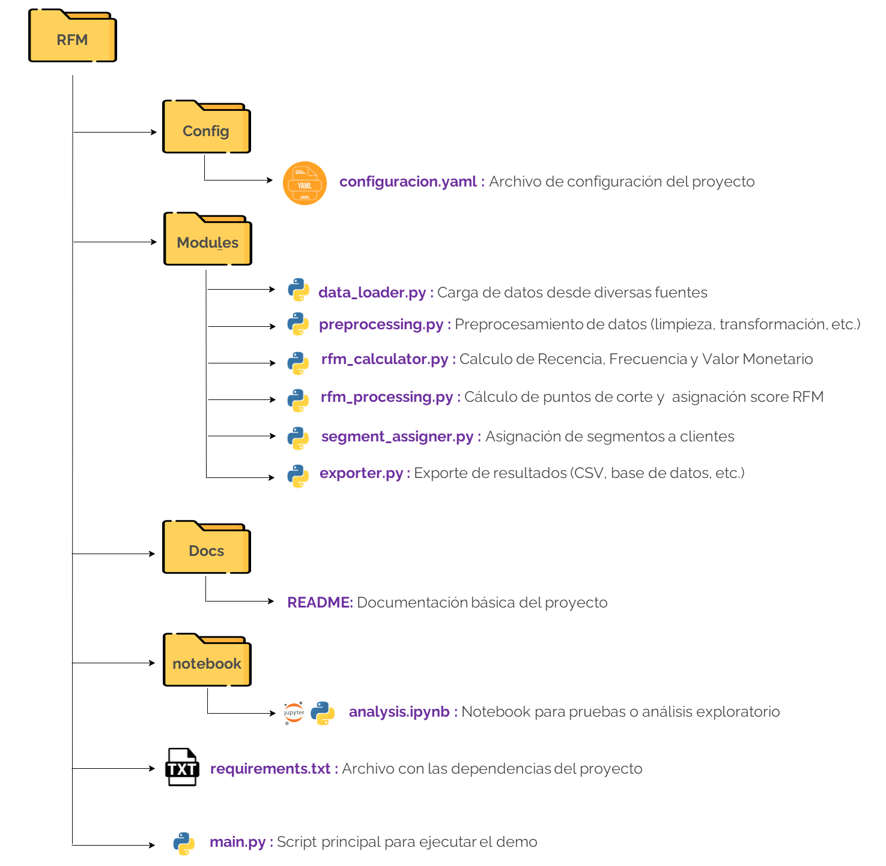

# 🎯  Demo RFM Adaptable

Este proyecto es una implementación de un modelo RFM (Recencia, Frecuencia y Valor Monetario) adaptable diseñado en Python. Su objetivo es proporcionar un análisis de segmentación de clientes eficiente y personalizable para diferentes negocios. 🚀

---

## 📋 Tabla de Contenidos

- [📖 Descripción](#📖-descripción)  
- [✨ Características Principales](#✨-características-principales)   
- [🖥️ Requerimientos](#🖥️-requerimientos)  
- [⚙️ Configuración del Entorno](#⚙️-configuración-del-entorno)  
- [🚀 Instrucciones de Uso](#🚀-instrucciones-de-uso)  
- [📂 Estructura del Proyecto](#📂-estructura-del-proyecto)  
- [🛠️ Configuración Personalizable](#🛠️-configuración-personalizable)  
- [📊 Flujo de Trabajo](#📊-flujo-de-trabajo)  
- [📎 Recursos Adicionales](#📎-recursos-adicionales)  

---

## 📖 Descripción
El modelo RFM es una herramienta de análisis que clasifica a los clientes en función de:
- **Recencia (R):** Tiempo transcurrido desde la última compra.
- **Frecuencia (F):** Número de compras realizadas en un período específico.
- **Monetario (M):** Valor total gastado por el cliente.

Este proyecto permite:
- Automatizar el cálculo de métricas RFM.
- Configurar fácilmente los parámetros desde un archivo YAML.
- Generar segmentaciones de clientes y exportar resultados listos para reportes en herramientas como **Qlik**.

---

## ✨ Características Principales
- **Configuración Personalizable:** Define parámetros como el número de categorías y los percentiles desde un archivo YAML.
- ✅ **Modularidad:** Código organizado en módulos para facilitar la escalabilidad.
- ✅ **Compatibilidad con Formatos de Datos Diversos:** Admite fuentes como CSV, Excel, Parquet y SQL.
- ✅ **Flexibilidad en la Exportación:** Exporta resultados en varios formatos.

---

## 🖥️ Requerimientos
| **Plataforma**        | **Lenguaje** | **IDE**          |
|----------------------|--------------|------------------|
| Windows/Linux/MacOS  | Python 3.8+  | VS Code / PyCharm |

---

## ⚙️ Configuración del Entorno

### 1️⃣ Clona el Proyecto

```
git clone https://github.com/Datecsa-ArquitecturaDatos/CienciaDatos-RFM
cd rfm_project
```

### 2️⃣ Configurar el Entorno Virtual
Crear un entorno virtual (recomendado) e instalar las dependencias:

```
# Crear el entorno
python -m venv venv

# Activar el entorno (Windows)
source venv/Scripts/activate

# Activar el entorno (Mac/Linux)
source venv/bin/activate
```

### 3️⃣ Instalar depencias
Instalar las dependencias necesarias listadas en el archivo requirements.txt

```
pip install -r requirements.txt
```

## 🚀 Instrucciones de Uso
1. Configuración: Editar el archivo configuracion.yaml en la carpeta config/ para definir los parámetros del análisis RFM según las necesidades del cliente.

2. **Ejecución del proyecto:** Correr el script principal `main.py` para procesar los datos y obtener los resultados:

```
python main.py
```
Este archivo conecta todos los módulos del proyecto de manera eficiente, permitiendo ejecutar el flujo completo del cálculo RFM y la asignación de segmentos.

🔄 **Flexibilidad:** Gracias a la estructura modular del proyecto, se puede:

- Modificar o añadir funcionalidades específicas sin alterar el resto del código.
- Utilizar directamente módulos como data_loader.py o rfm_calculator.py en scripts personalizados para tareas específicas.

📚 **Análisis Exploratorios Iniciales:**
Si se necesita explorar y analizar los datos antes de configurar los parámetros del modelo RFM:
- **Uso de notebooks** (se puede añadir a la carpeta `notebook/`) para realizar un análisis exploratorio.
- **Identifica patrones, outliers y distribuciones clave** que ayuden a configurar el archivo `configuracion.yaml`.

---

## 🗂️ Estructura del Proyecto



---

## 🛠️ Configuración Personalizable
El archivo configuracion.yaml define los parámetros del análisis. Configúrarlo antes de ejecutar el proyecto.

```
score_method: "combinación"  # Método de cálculo de score: combinación, suma, promedio
business_categories:
  Platino: ['445', '454', '455', '544', '545', '554', '555']
  Oro: ['344', '345', '353', '354', '355', ...]
```

---
## 📊 Flujo de Trabajo

**1. Ingestión de Datos:** data_loader.py valida y carga los datos desde las fuentes configuradas.<br>
**2. Preprocesamiento:** preprocessing.py limpia y transforma los datos para el análisis<br>
**3. Cálculo de Métricas RFM:** rfm_calculator.py computa las métricas RFM.<br>
**4. Asignación Score:** rfm_processing.py Manejo de outliers, definición de puntos de corte y asignación de Score RFM.<br>
**5. Asignación de Segmentos:** segment_assigner.py clasifica a los clientes en segmentos comerciales según las puntuaciones RFM.<br>
**6. Exporte de Resultados:** exporter.py Los resultados finales (incluidas las categorías de clientes) se exportan en el formato especificado en el archivo de configuración para facilitar su integración con otros sistemas o su visualización en plataformas como Qlik.

---

## 📎 Recursos Adicionales
- **Documentación:** La carpeta Doc/ contiene guías y documentación.
- **Notebooks:** Utiliza la carpeta notebook/ para explorar los datos y realizar análisis adicionales.
- **Reportes:** Los resultados están diseñados para integrarse con herramientas como Qlik.

---


